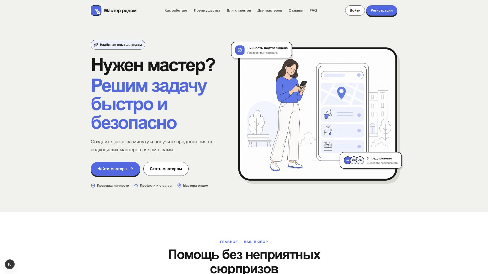
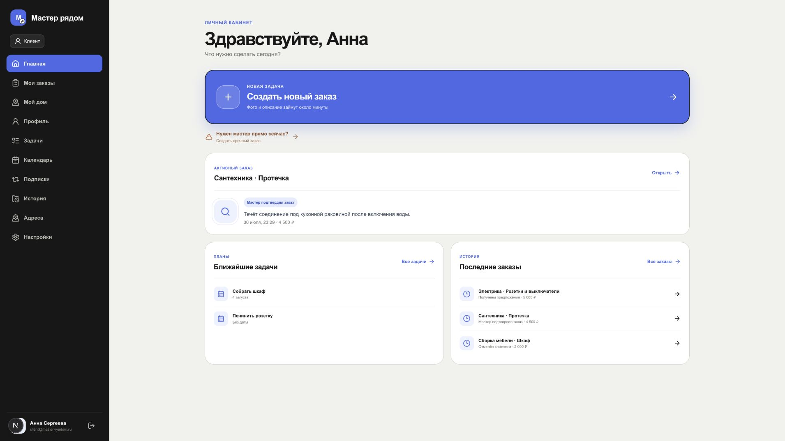
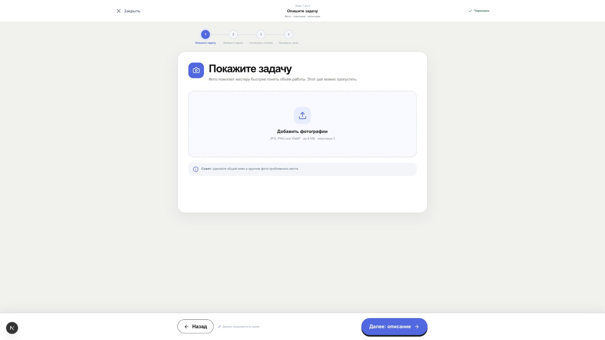
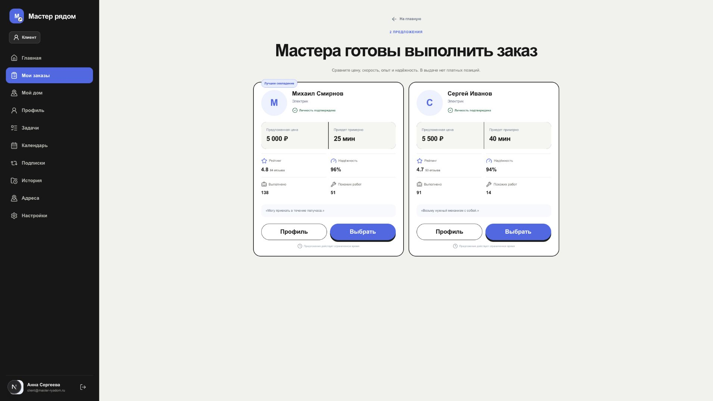
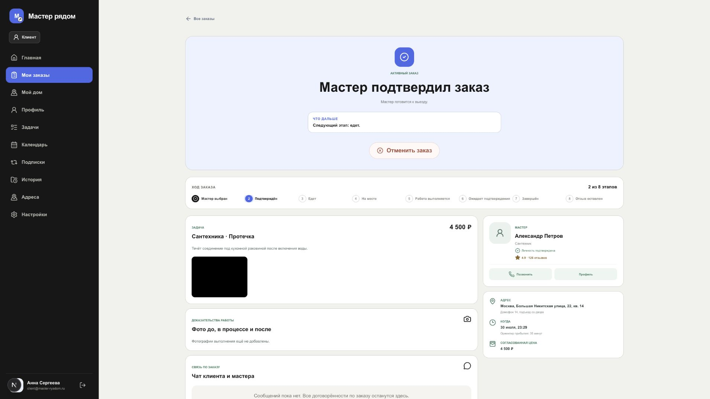
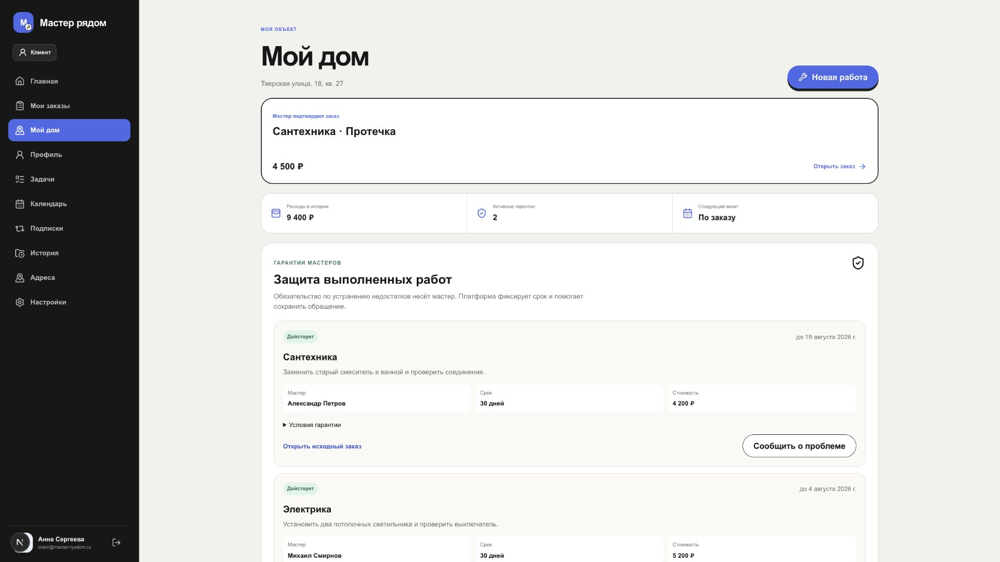
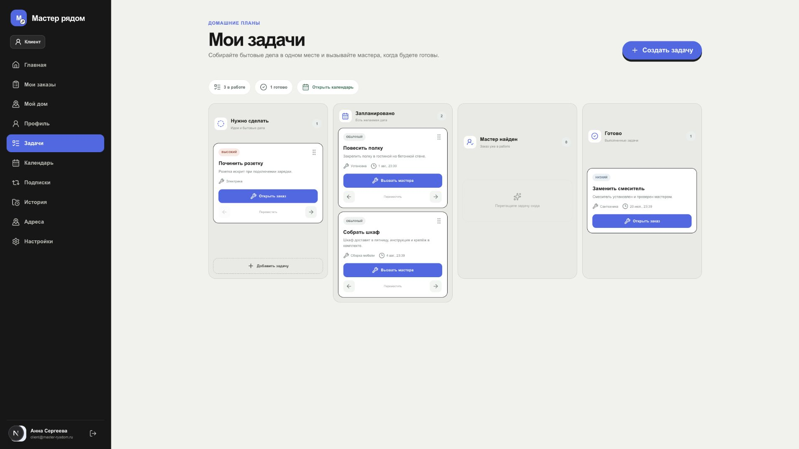
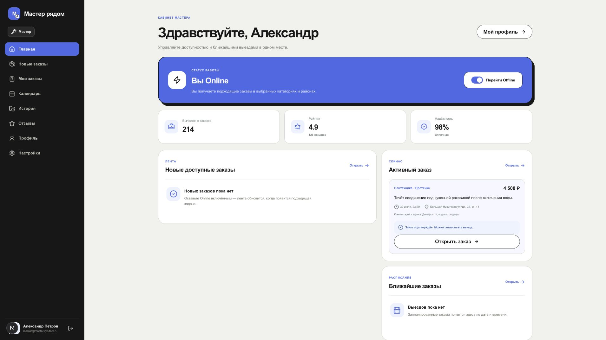
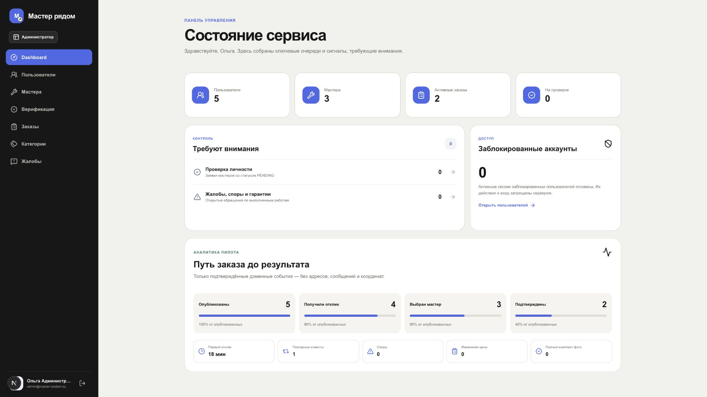

# Продуктовый и UX-аудит «Мастер рядом»

Дата: 1 августа 2026 года
Ветка: `codex/feat-home-trust`
Режим: best guess по текущему интерфейсу, коду, тестам и продуктовой документации

## Статус реализации от 2 августа 2026 года

- P0 «Честный лендинг» реализован: удалены неподтверждённые обещания скорости, синтетические отзывы явно помечены как демонстрационные примеры, metadata приведена к фактическому поведению.
- P1 «Навигация вокруг Моего дома» реализован частично: в основной навигации клиента оставлены «Главная», «Заказы», «Мой дом», «Профиль»; задачи, календарь, регулярные работы и адреса доступны из хаба «План дома».
- Рабочие URL сохранены для обратной совместимости. На вложенных экранах добавлен возврат в «Мой дом».
- Следующий незакрытый слой: разделение журнала на события, выполненные работы и гарантии, затем объектная модель зон и оборудования.

## Итог

Общая оценка текущего продукта: **7,2/10**.

- Сила идеи и дифференциации: **8,7/10**.
- Готовность core marketplace flow: **8,0/10**.
- Доверие и безопасность MVP: **7,0/10**.
- Desktop UX/UI: **8,0/10**.
- Домашний retention-слой: **6,0/10**.
- Готовность к ограниченному пилоту: **6,5/10**.
- Доказанность спроса: **4,0/10**.

Продукт уже выглядит как связный MVP, а не набор макетов. Его лучшая вертикаль: заказ, сравнение мастеров, договорённость, выполнение, доказательства, гарантия и история дома. Главный риск состоит в преждевременном расширении из ремонта в универсальную систему управления домом до проверки ликвидности базового маркетплейса.

## Проверенный путь

### Шаг 1. Лендинг, здоровье: требует правок перед публичным пилотом

Сильная визуальная иерархия, понятные роли клиента и мастера, заметный основной CTA. Риск доверия: обещания «быстро и безопасно», «за минуту» и отзывы выглядят как подтверждённые факты, хотя текущая среда содержит демонстрационные данные, а SLA ещё не измерен.

### Шаг 2. Главная клиента, здоровье: хорошее

Главное действие заметно, активная работа и ближайшие задачи собраны на одном экране. Проблема информационной архитектуры: десять пунктов боковой навигации конкурируют между собой. «Задачи», «Календарь», «Подписки», «История» и «Адреса» должны стать подразделами «Моего дома».

### Шаг 3. Создание заказа, здоровье: хорошее с риском завершения

Пошаговый поток понятен, прогресс виден, черновик сохраняется. Фото проблемы можно пропустить, это снижает трение, но может ухудшить качество откликов. Нужно измерить долю заказов без фото и их time-to-first-offer, а не делать фото обязательным без данных.

### Шаг 4. Сравнение предложений, здоровье: сильное

Это лучший экран продукта. Цена, ETA, рейтинг, надёжность и похожие работы сравниваются без открытия профиля. Плюс: прямо сказано, что платных позиций нет. Недостаёт объяснения расчёта «надёжности» и статуса квалификации мастера.

### Шаг 5. Активная работа, здоровье: сильное

Статус и следующий шаг ясны. Чат, доказательства и неизменяемая история находятся в контексте заказа. Кнопка отмены визуально заметнее полезных действий, хотя отмена является вторичным и рискованным действием. На следующих статусах основным действием должен быть переход жизненного цикла, например «Мастер выехал» или «Принять работу».

### Шаг 6. Паспорт дома, здоровье: перспективное

Гарантия мастера описана честно, без обещания компенсации платформы. Расходы, исходный заказ и обращение связаны. Сейчас «Журнал работ» включает активные и отменённые заказы, поэтому название вводит в заблуждение. Журнал должен разделять выполненные работы, активность и отмены. Модель пока фактически рассчитана на один адрес, без оборудования и планов обслуживания.

### Шаг 7. Домашние задачи, здоровье: рабочее, но фрагментированное

Задача может превратиться в заказ, предусмотрены кнопки перемещения помимо drag-and-drop. Это хорошая связка с marketplace. Но текущая доска остаётся общим Kanban: нет объекта, зоны, оборудования, чек-листа, инструментов, материалов, самостоятельного завершения с фото и автоматического повторения.

### Шаг 8. Кабинет мастера, здоровье: хорошее

Online-статус, активная работа и расписание собраны правильно. Мастер понимает, что делать сейчас. Для реального пилота нужны доставка критических уведомлений, конфликт расписания, причины matching и подтверждённая экономика выплаты.

### Шаг 9. Администрирование, здоровье: достаточное для concierge-пилота

Очереди верификации, жалоб и гарантий видны. Funnel использует доменные события без адресов и сообщений, это правильная граница приватности. Funnel пока заканчивается подтверждением заказа и не показывает completion, отмены по сторонам, спор, отзыв и повтор.

## Что работает лучше всего

1. Прозрачное сравнение предложений вместо каталога случайных исполнителей.
2. Серверная приватность адреса до выбора мастера.
3. Согласование новой цены, обязательные evidence и заказный чат.
4. Гарантия мастера, связанная с исходным заказом и фотографией проблемы.
5. Задача, заказ, календарь и паспорт уже используют общую доменную историю.

## Проблемы по приоритетам

### P0 до публичного пилота

1. Исправить правдивость лендинга: маркировать демонстрационные отзывы, убрать неподтверждённые SLA и объяснить границы безопасности.
2. Не принимать реальные деньги до PSP-backed reserve, ledger, refund, dispute hold и reconciliation.
3. Завершить trust and safety: защищённое хранение документов, retention, audit log, апелляция и emergency-процесс.
4. Обеспечить критические уведомления для цены, выбора, выезда, прибытия, завершения и спора.
5. Перед production перейти на один PostgreSQL runtime и object storage. Не поддерживать постоянный dual-write.

### P1 после закрытого concierge-пилота

1. Свернуть навигацию клиента вокруг «Главная», «Заказы», «Мой дом», «Профиль».
2. Довести funnel до подтверждённого завершения, спора, отзыва и повтора.
3. Добавить повтор заказа у того же мастера.
4. Ввести объект, зону, оборудование и maintenance plan в «Моём доме».
5. Добавить самостоятельное выполнение задачи, чек-лист, материалы, инструменты и следующее повторение.

### P2 после сигнала retention

1. Семейный доступ.
2. Сезонные планы ухода.
3. Закреплённые мастера и регулярные услуги.
4. Партнёрские покупки материалов.
5. Настоящая live-location при отдельном consent и ограниченной сессии.

## Продуктовая позиция

Рекомендуемый первый сегмент: владелец квартиры или дома, которому нужна бытовая работа до 15 000 ₽ и который боится неизвестного исполнителя и изменения цены после приезда.

Рекомендуемое обещание пилота:

> Сравните проверенных мастеров, согласуйте итоговую цену до работы и сохраните доказательства результата.

«Операционная система дома» является сильным направлением удержания, но не должна быть главным обещанием до доказательства marketplace liquidity.

## Метрики пилота

[assumption] Стартовые gates для пилота с 50 домохозяйствами, 30 проверенными мастерами, двумя категориями и одной географической зоной:

- не менее 70% опубликованных заказов получают первый валидный отклик за 30 минут;
- не менее 50% заказов с откликом заканчиваются выбором мастера;
- не менее 80% подтверждённых заказов завершаются приёмкой;
- доля споров не выше 10%;
- не менее 20% клиентов создают повторный заказ в течение 60 дней;
- не менее 30% завершённых заказов открываются в паспорте дома повторно в течение 30 дней.

Эти значения являются гипотезами, а не отраслевыми бенчмарками.

## Доступность и ограничения проверки

Подтверждённые сильные стороны: навигационные области имеют подписи, заголовки структурированы, интерактивные действия в основном являются ссылками и кнопками, Kanban имеет альтернативу drag-and-drop.

Вероятные риски: вторичный текст и подписи местами слишком мелкие и светлые, статусы полагаются на цвет и короткие подписи, focus-visible и чтение системных обновлений экранным диктором требуют отдельной проверки. Полная клавиатурная навигация, zoom/reflow и assistive technology в этом аудите не проверялись. Мобильный screenshot был отклонён из-за некорректной работы viewport capture, поэтому мобильная компоновка не получила доказательную оценку.

## Техническая проверка

- `npm run lint`: 0 ошибок, 1 существующее предупреждение в `prisma.config.ts`.
- `npm run typecheck`: пройдено.
- `npm test`: 26 из 26 пройдено.
- Runtime сейчас: SQLite через `better-sqlite3`; Prisma/PostgreSQL остаётся незавершённым переходом.

STATUS: DONE_WITH_CONCERNS. Основные concerns: нет реальных продуктовых baseline, публичный лендинг обещает больше измеренного, scope расширяется быстрее, чем проверяется core marketplace.
